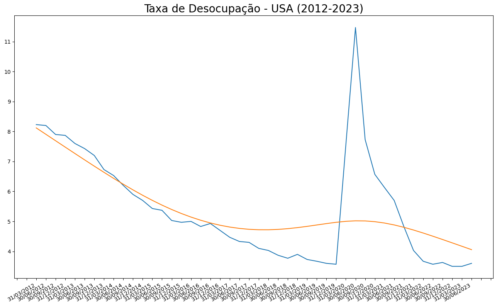
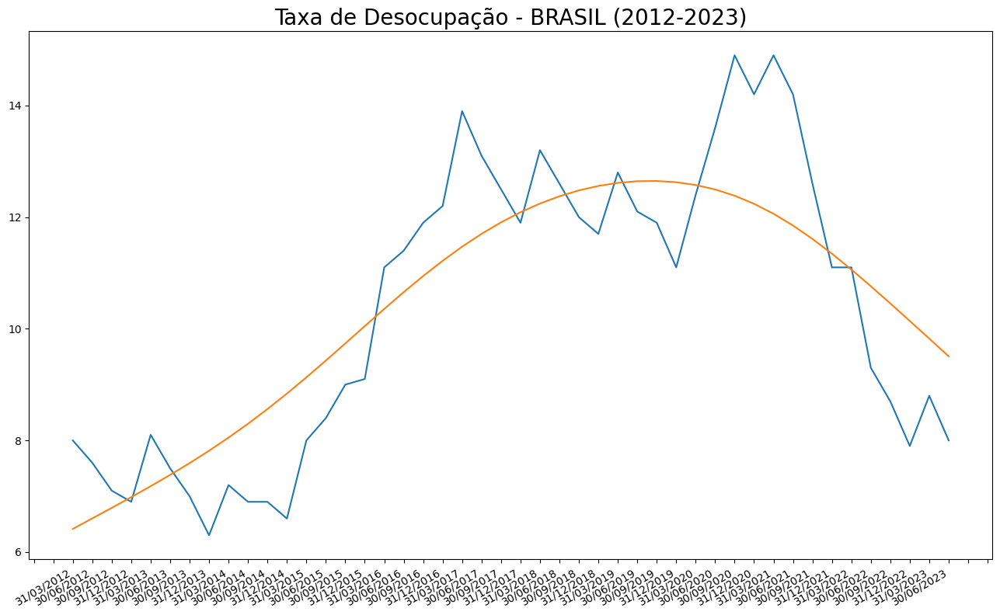

# Dados Macroeconômicos
Esse repositório armazenará trabalhos realizados na cadeira de Macroeconomia I, do curso de Economia. As atividades passam pela extração, tratamento, visualização e análise de dados macroeconômicos em fontes como IPEADATA, SIDRA/IBGE e FED.
A linguagem Python foi utilizada para execução das análises.

## Série histórica do desemprego

  
   

